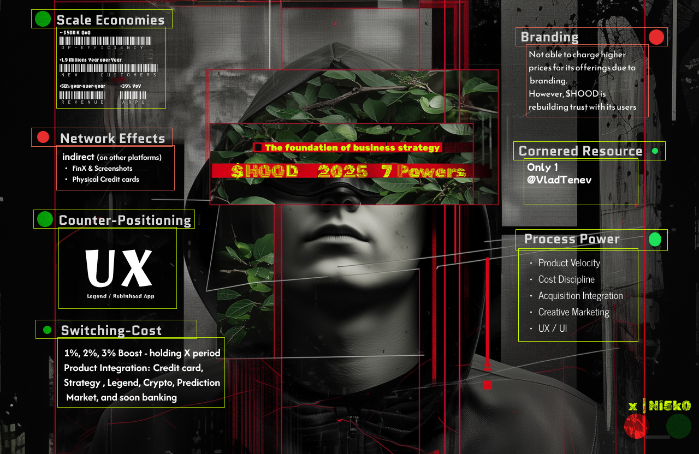

# investing in imagination

My investment journey + Fiancial AI imagination !

## Projects 

- [ATH Videos with a spark of AI, enjoy!](https://ni5k0.github.io/investing_in_imagination/ath_videos/)
    
        I only create videos when a holding I have reaches ATH by a dollar. 

- [Portoflio View: Galactic Holdings](https://ni5k0.github.io/galactic_holdings/)

        Explore your stock portfolio in a 3D cosmic landscape, where tickers orbit as planets scaled by allocation, connected by a rocket's journey through space

## $HOOD Thesis

    My investment strategies



X Post: https://x.com/ni5k0/status/1942026312476185079

```
🔖 The foundation of business strategy by Hamilton Helmer. 

✅ 1. Scale Economies 

❌ 2. Network Economies

✅ 3. Counter-Positioning

✅ 4. Switching Cost

❌ 5. Branding

✅ 6. Corner Resource (updated from ❌ -> ✅)

✅ 7. Process Power
```
