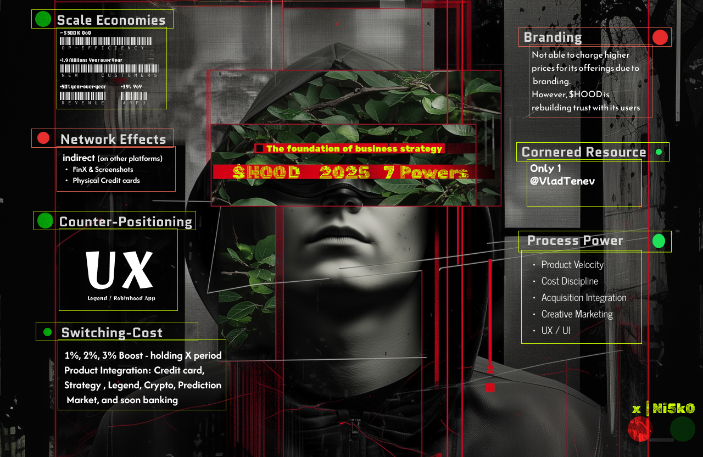
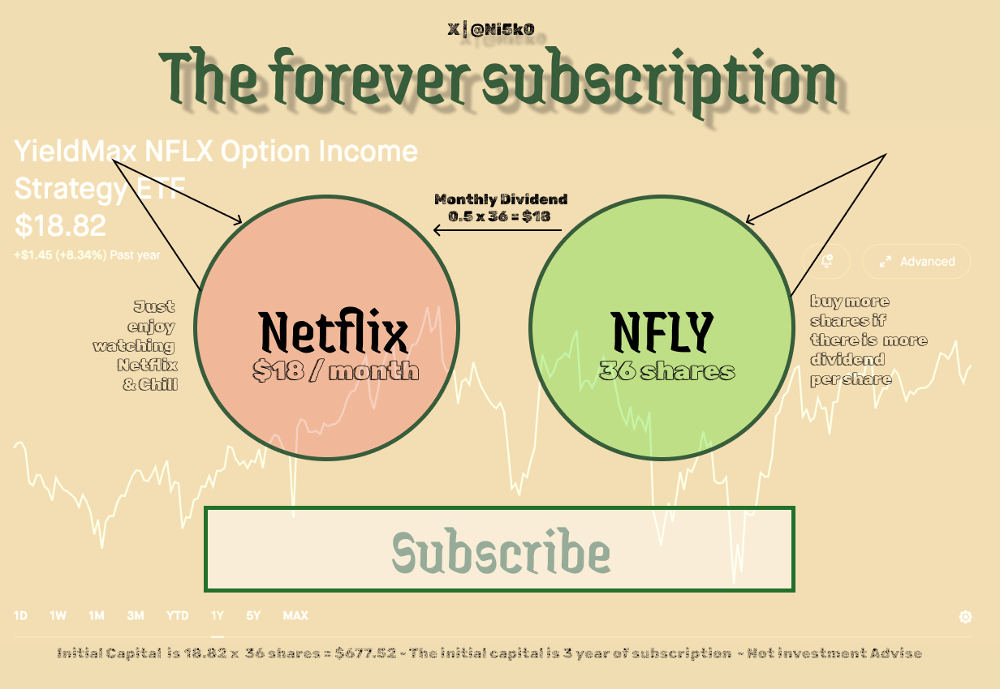
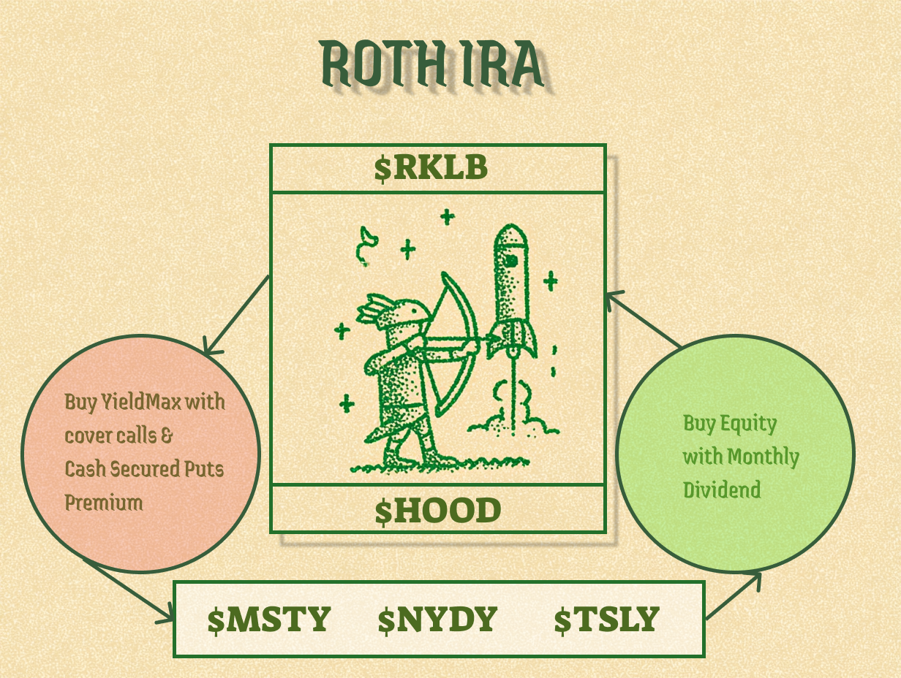

# investing in imagination

My investment journey + AI imagination !

 🔴_🟢

## Projects 

- [ATH Videos with a spark of AI, enjoy!](https://ni5k0.github.io/investing_in_imagination/ath_videos/)
    
        A celebration of a company reaching ATH by a dollar with a spark of AI 

- [Portoflio View: Galactic Holdings](https://ni5k0.github.io/galactic_holdings/)

        Explore your stock portfolio in a 3D cosmic landscape, 
        where tickers orbit as planets scaled by allocation, 
        connected by a rocket's journey through space.

## $HOOD Thesis

    My analysis of $HOOD using
    The foundation of business strategy by Hamilton Helmer
    Framework



```
🔖 The foundation of business strategy by Hamilton Helmer. 

✅ 1. Scale Economies 

❌ 2. Network Economies

✅ 3. Counter-Positioning

✅ 4. Switching Cost

❌ 5. Branding

✅ 6. Corner Resource (updated from ❌ -> ✅)

✅ 7. Process Power
```

X Post: https://x.com/ni5k0/status/1942026312476185079

## $NFLY Paid once - subscribe forever 

    The utility of an investment for entertainment. Use $NFLY div
    & paid for Netflix subscription. 

    This strategy can be applied to any subscriptions. The 
    downside is that the net asset value might erode over time.



X Post: https://x.com/ni5k0/status/1941553624053842069

## Roth IRA Strategy

Roth IRA has a contribution limit & cash can be generated with Dividend and options. The $ generated from one asset type will be used to buy shares on the other asset type.



**Equity: $HOOD + $RKLB**
> The bear case is that Robinhood takes out the "buy" button & Rocker lab don't launch any more rockets
> Use premium from Cover calls & Cash Secure puts to buy YieldMax ETF

**YieldMax ETF: $MSTY + $NYDY + $TSLY**
> New contribution will be going toward YieldMax ETF
> Nav might erode 
> Dividend will be used to buy $HOOD & $RKLB

X Post: https://x.com/ni5k0/status/1941508051833585872

---

*Disclaimer: This is not investment advice. All content is for informational and entertainment purposes only. Please consult with a qualified professional before making any investment decisions.* 